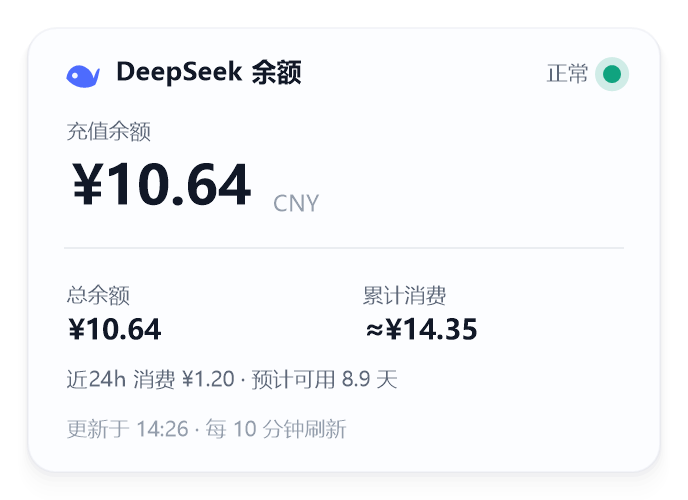
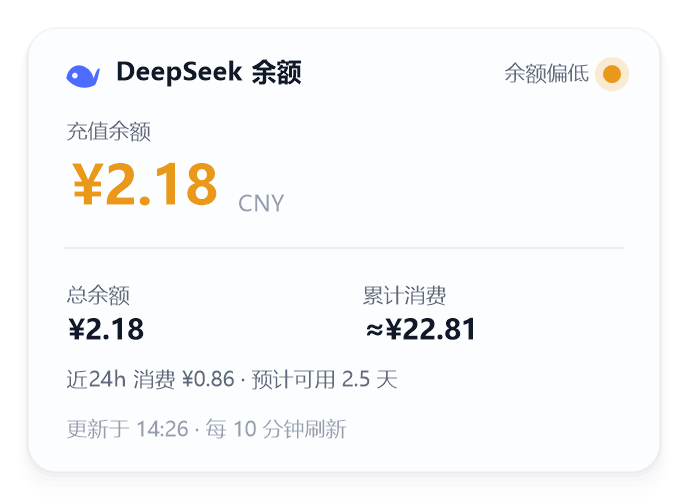
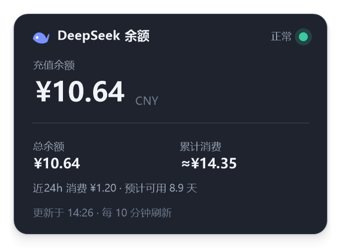
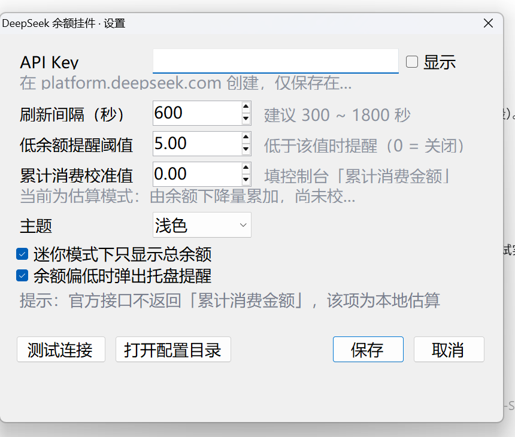

# DeepSeek 余额挂件

把 DeepSeek 开放平台的余额常驻在桌面上，不用再开网页看「充值余额 / 累计消费金额」。
一个 exe，无依赖、无安装、不需要 Python 或 Node。



## 快速开始

1. 双击 `DeepSeekPet.exe`，卡片会出现在桌面右下角（透明、圆角、置顶）。
2. 右键卡片 → **设置…** → 填入 API Key → **测试连接** → **保存**。
   API Key 在 [platform.deepseek.com](https://platform.deepseek.com/api_keys) 的 API keys 页面创建。
3. 之后每 10 分钟自动刷新一次；左键单击卡片可立即刷新。

也可以直接写入 Key（不打开界面）：

```powershell
DeepSeekPet.exe --key sk-xxxxxxxx
```

想先看看效果、暂不配置 Key：

```powershell
DeepSeekPet.exe --demo
```

## 操作方式

| 操作 | 效果 |
| --- | --- |
| 左键单击 | 立即刷新余额 |
| 左键拖动 | 移动位置（自动记忆，下次启动回到原位） |
| 左键双击 | 在完整卡片 / 迷你胶囊之间切换 |
| 右键 | 菜单：刷新、迷你模式、总在最前、隐藏、打开充值页、打开用量页、设置、开机自启、关于、退出 |
| 托盘图标左键 | 显示 / 隐藏挂件 |
| `Ctrl + Alt + Q` | 全局快捷键，显示 / 隐藏挂件 |

迷你胶囊模式只占一个小胶囊的位置，显示总余额和状态点：


## 显示内容



| 字段 | 含义 |
| --- | --- |
| 充值余额 | 官方接口的 `topped_up_balance`，精确值 |
| 总余额 | 官方接口的 `total_balance`（充值余额 + 未过期的赠送余额） |
| 累计消费 | 控制台里的「累计消费金额」，**本地估算**，见下文 |
| 近 24h 消费 / 预计可用 N 天 | 依据本机采样记录推算，仅供参考 |
| 状态点 | 绿=正常，黄=余额低于阈值，红=请求失败 |

深色主题（设置 → 主题 → 深色，或跟随系统）：



## 数据来源与准确性

**充值余额 / 赠送余额 / 总余额**：来自官方接口
`GET https://api.deepseek.com/user/balance`，是精确值。

**累计消费金额**：官方余额接口**不提供**该字段（只在控制台页面显示）。因此本程序显示的是
`≈¥` 估算值，计算方式是：以你在设置里填写的**校准值**为起点，把每次采样之间余额的下降量累加。

使用建议：

- 第一次使用，请在设置里把控制台显示的「累计消费金额」填进 **累计消费校准值** 并保存，
  之后显示即为对齐值（不再带 `*`）。
- 未校准时显示形如 `≈¥1.32*`，只统计本机运行期间的消费。
- 关机或程序未运行期间如果同时发生了充值和消费，估算会出现偏差，建议隔一段时间重新校准一次。
- 赠送额度过期也会表现为余额下降，可能被计入消费 —— 这是已知误差。

## 设置项



- **API Key**：只保存在本机配置文件里，程序只访问 `api.deepseek.com`。
- **刷新间隔**：默认 600 秒（10 分钟），最小 60 秒。
- **低余额提醒阈值**：充值余额低于该值时，卡片转为黄色提醒并弹出托盘通知（0 = 关闭）。
- **累计消费校准值**：填入控制台数字即可对齐。
- **主题**：跟随系统 / 浅色 / 深色。
- **迷你模式**、**余额偏低时弹出托盘提醒**。

## 文件位置

`settings.json`（配置）与 `state.json`（采样历史、消费估算）位于 exe 同目录；
若该目录不可写（例如放在 `Program Files`），会自动改用 `%APPDATA%\DeepSeekPet\`。
删除这两个文件即可恢复初始状态。

## 命令行参数

| 参数 | 说明 |
| --- | --- |
| `--key sk-xxx` | 写入 API Key 后退出 |
| `--demo` | 用演示数据启动（不需要 Key） |
| `--settings` | 直接打开设置窗口 |
| `--selftest` | 运行自检并生成 `selftest-report.txt` |
| `--diag` | 输出屏幕 / DPI / 尺寸诊断信息（排障用） |
| `--capture 文件` | 抓取主屏截图（排障用） |
| `--render 文件` | 渲染界面预览图（`--state ok\|low\|unc\|error\|empty`、`--mini`、`--dark`、`--scale 2`） |

## 系统要求

- Windows 10 / 11，需要系统自带的 .NET Framework 4.x（Win10 起默认包含）
- 无需管理员权限；开机自启通过写入当前用户的 `Run` 注册表项实现，可随时在菜单里关闭

## 从源码重新编译

```powershell
powershell -ExecutionPolicy Bypass -File build.ps1
```

使用 Windows 自带的 `csc.exe`（.NET Framework 4.x），源码在 `src/`：

| 文件 | 作用 |
| --- | --- |
| `Program.cs` | 入口、命令行、自检 |
| `WidgetForm.cs` | 挂件窗口：拖动、悬停、托盘、热键、刷新调度 |
| `Renderer.cs` | 卡片 / 胶囊绘制、配色、DPI 缩放 |
| `SettingsForm.cs` | 设置窗口 |
| `Api.cs` | DeepSeek 余额接口客户端与累计消费估算 |
| `Store.cs` | 配置与状态持久化 |
| `Layered.cs` | 分层透明窗口（逐像素 Alpha、透明区域鼠标穿透） |
| `Json.cs` | 极简 JSON 读写 |

## 常见问题

- **提示「API Key 无效或已失效（401）」**：Key 复制不完整或已在控制台删除，重新生成后填入。
- **提示无法连接**：公司网络或代理拦截；可先用浏览器打开 `api.deepseek.com` 验证。
- **挂件不见了**：左键单击托盘图标，或按 `Ctrl + Alt + Q`。
- **热键无效**：`Ctrl + Alt + Q` 可能被其它软件占用，用托盘图标即可。
- **多显示器 / 高 DPI**：界面按屏幕 DPI 自动缩放，位置限定在工作区内，不会跑到屏幕外。

## 为什么不做成 Codex 应用内的宠物

Codex 的宠物是一套 8×11 的动画精灵图资源（`spriteVersionNumber: 2`），只承载动画状态，
无法显示实时数字。要做「随时扫一眼余额」，桌面常驻卡片是真正可行的形态；
如果只是想要动画形象，可以另外用 `hatch-pet` 生成宠物精灵图，两者互不冲突。
